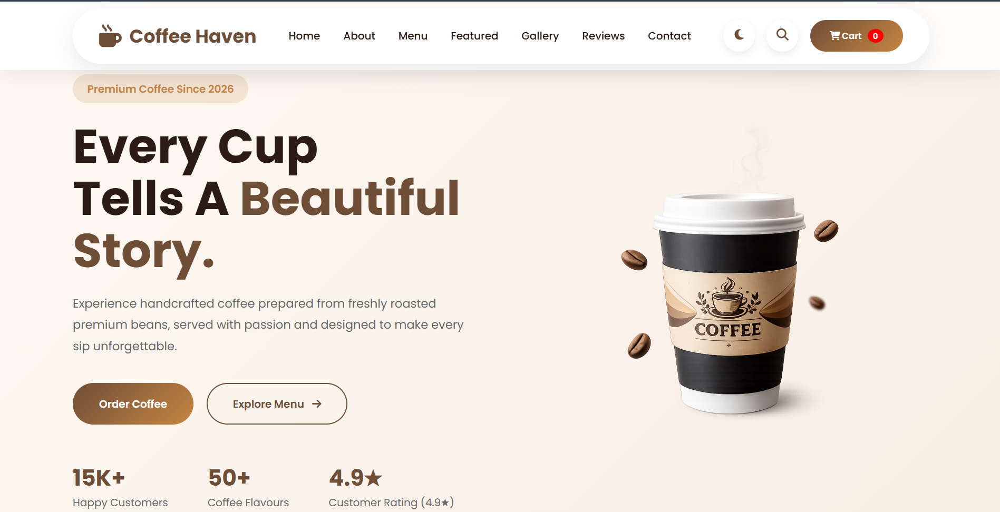
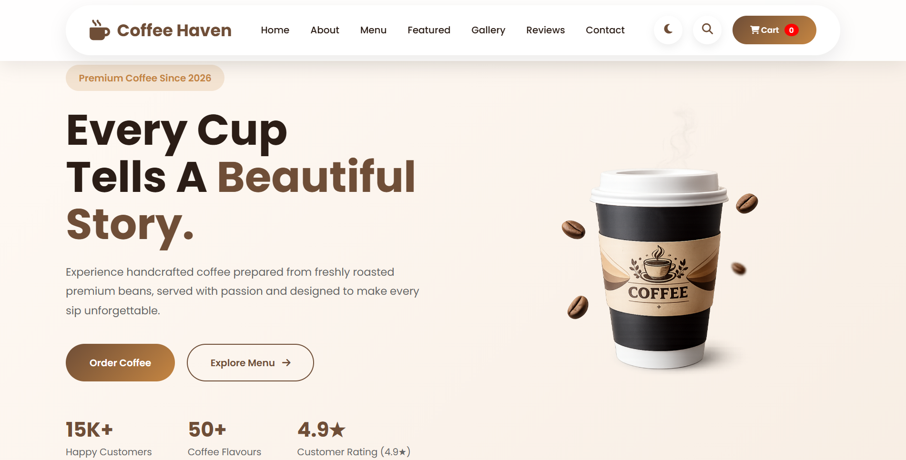
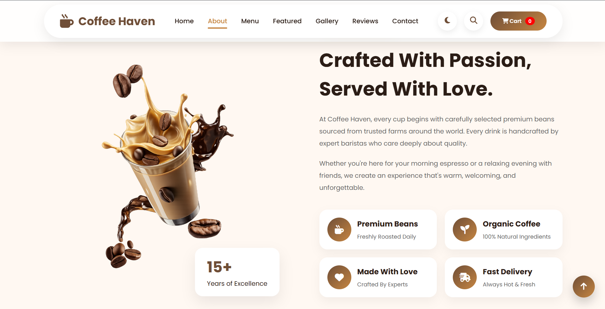
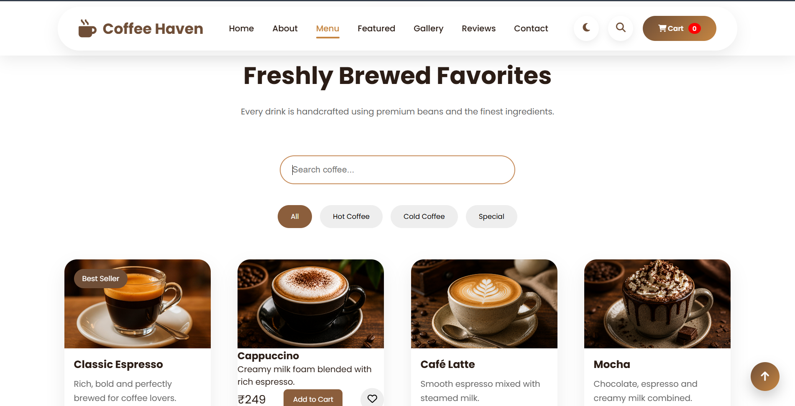
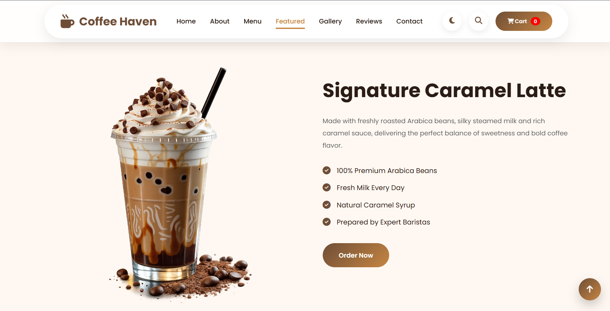
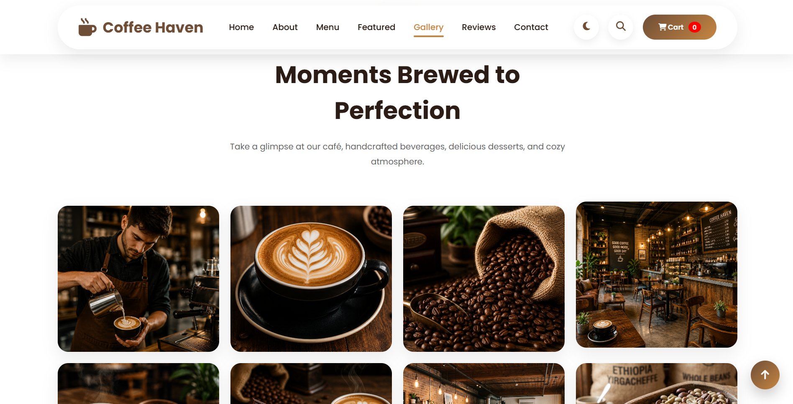
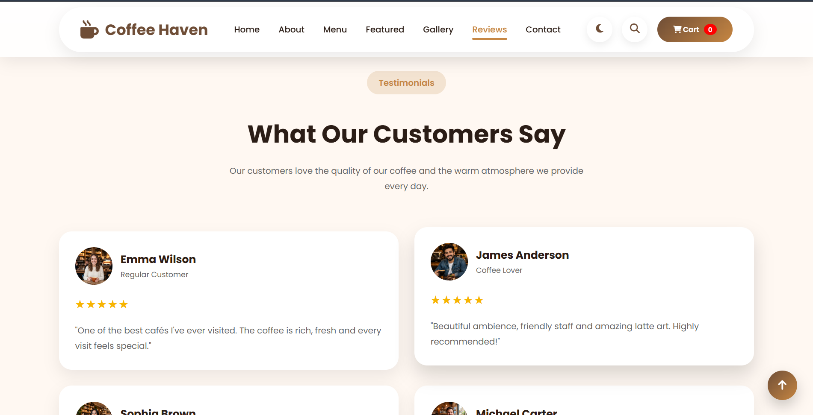
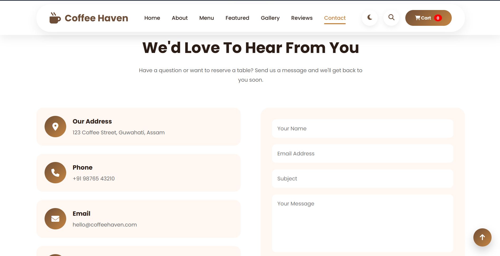

<div align="center">

# ☕ Coffee Haven


<h3>
Modern Coffee Shop Website built using HTML • CSS • JavaScript
</h3>


<br>

<a href="https://coffee-haven.vercel.app">

</a>

<a href="https://github.com/AashmikChakraborty/Coffee-Haven">

</a>

</div>

---

# 🏆 Badges

<p align="center">


</p>

---

# 📖 About

Coffee Haven is a premium coffee shop landing page designed with a modern UI, smooth animations and interactive user experience.

The project showcases handcrafted coffee collections, featured beverages, image galleries, customer testimonials, Google Maps integration and responsive layouts.

Designed to resemble a real-world commercial coffee website.

---

# 💻 Desktop View

<p align="center">

</p>

---

# 📱 Mobile View

<p align="center">

</p>

---

# ✨ Features

| Feature | Status |
|---------|--------|
| Responsive Design | ✅ |
| Premium Hero Section | ✅ |
| About Section | ✅ |
| Coffee Menu | ✅ |
| Menu Search | ✅ |
| Featured Coffee | ✅ |
| Image Gallery | ✅ |
| Customer Reviews | ✅ |
| Contact Form | ✅ |
| Google Maps | ✅ |
| Newsletter | ✅ |
| Dark Mode | ✅ |
| Scroll Animations | ✅ |
| Shopping Cart UI | ✅ |

---

# 📸 Website Preview

## Home



---

## About



---

## Menu



---

## Featured Coffee



---

## Gallery



---

## Reviews



---

## Contact



---

# ⚙️ Tech Stack

<p align="center">


</p>

---

# 🚀 Installation

Clone the project

```bash
git clone https://github.com/AashmikChakraborty/Coffee-Haven.git
```

Move inside

```bash
cd Coffee-Haven
```

Run

```
index.html
```

---

# 📂 Project Structure

```
Coffee-Haven

assets/

css/

js/

images/

screenshots/

README.md

index.html
```

---

# 🎯 Why this Project?

✔ Modern Commercial UI

✔ Recruiter Friendly

✔ Fully Responsive

✔ Interactive Components

✔ Clean Folder Structure

✔ Professional Design

✔ Realistic Coffee Website

---

# 📈 Future Scope

- Backend Integration

- Login System

- Shopping Cart Backend

- Razorpay Integration

- User Dashboard

- Admin Panel

- Product Database

- Online Ordering

- Wishlist

- Payment Gateway

---

# 👨‍💻 Developer

## Aashmik Chakraborty

B.Tech Computer Science Engineering

GitHub

https://github.com/AashmikChakraborty

---

# ⭐ Support

If you enjoyed this project,

⭐ Star this Repository

🍴 Fork this Repository

Share your feedback.

---

<div align="center">

Made with ❤️ by Aashmik Chakraborty

Coffee Haven © 2026

</div>